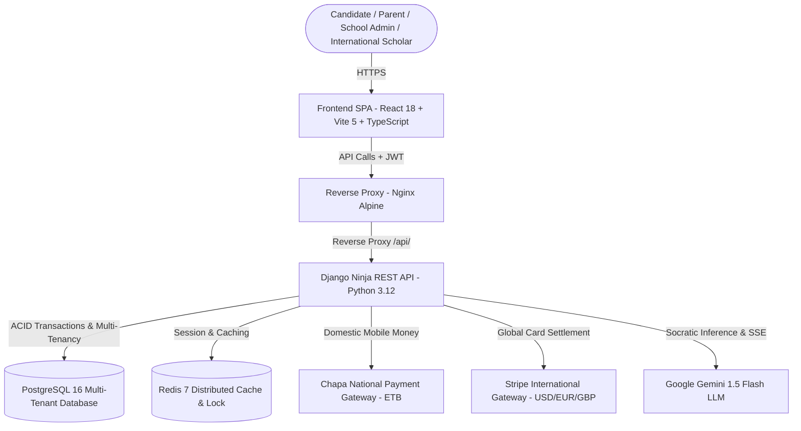
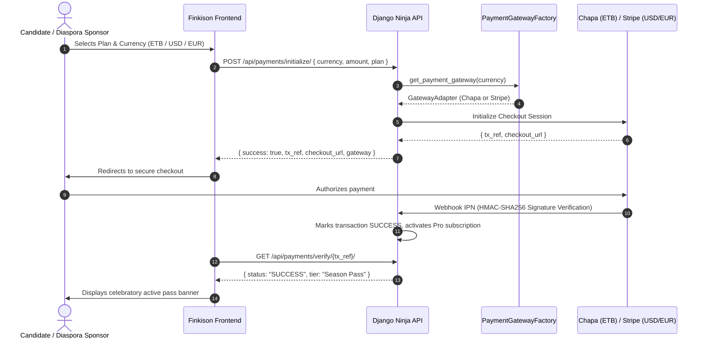
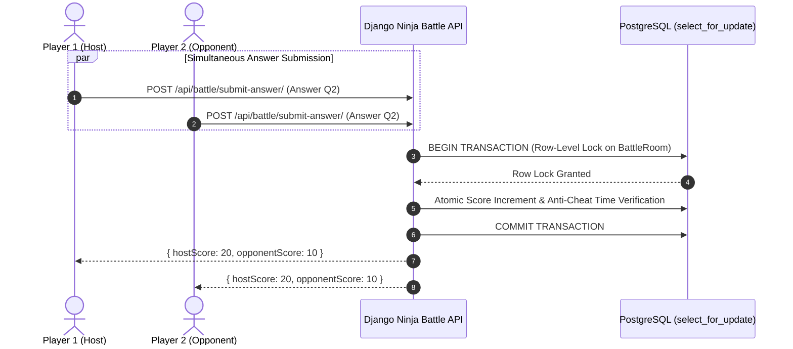

# Finkison Enterprise System Architecture & C4 Topology

## 1. System Context & Architecture Overview

Finkison is an enterprise-grade digital education and examination platform engineered for secondary candidates and institutional educators, supporting both domestic Ethiopian Entrance curricula (EUEE) and international candidates.

---

## 2. Enterprise Component Specifications

### 2.1 Frontend Architecture (`Frontend/`)
- **Core Runtime:** React 18 with TypeScript 5 (Strict Mode).
- **Security & RBAC:**
  - `<ProtectedRoute />`: Enforces authentication and granular role validation (`STUDENT`, `PARENT`, `TEACHER`, `PRINCIPAL`, `ADMIN`).
- **State Management:**
  - `authStore.ts`: Authenticated profile with persistent `localStorage` synchronization and cryptographic JWT token management.
  - `sessionStore.ts`: Active exam state with crash-proof persistence and section partitioning.
  - `battleStore.ts`: 1v1 duel arena state, real-time score tracking, round synchronization, and AI bot sparring modes.
- **Internationalization & Localization:**
  - Trilingual engine (`en`: English, `am`: Amharic አማርኛ, `om`: Afaan Oromoo) via `i18next` and `useI18n`.
  - Dual-Calendar Engine (`localization.ts`): Seamless simultaneous rendering of Gregorian (G.C.) and Ethiopian (E.C.) dates.
  - Multi-Currency Formatter (`ETB`, `USD`, `EUR`, `GBP`).
- **Automated Testing Suite:**
  - Vitest + jsdom test suite verifying authentication state, localization formatting, and battle duel mechanics.

### 2.2 Backend Architecture (`Backend/`)
- **Framework:** Django 5 with Django Ninja (Pydantic type enforcement, OpenAPI 3.0 schema generation).
- **Domain-Driven Modular Monolith (`apps/core/routers/`):**
  - `auth_router.py`: RFC-7519 compliant JWT issuance, password verification, profile endpoints.
  - `parent_router.py`: Real child progress telemetry, database-persisted parent alerts, and parent-teacher messaging.
  - `school_router.py`: Multi-tenant school telemetry, class roster management, exam assignments, and live CSV export.
  - `payment_router.py`: Multi-gateway payment router supporting Chapa and Stripe with dynamic currencies (`ETB`, `USD`, `EUR`, `GBP`).
  - `portal_router.py`: Leaderboard with composite indexing, scholarships, university cutoffs, and health probes.
- **Multi-Tenancy & Institutional Entities:**
  - `School`, `Classroom`, `TeacherProfile`, `ParentProfile`, `ParentAlert`, `ParentTeacherMessage`, `ExamAssignment`.
- **Payment Gateway Abstraction (`payment_gateways/`):**
  - Pluggable Adapter Pattern: `ChapaGateway` for domestic mobile money (Telebirr, CBE Birr), `StripeGateway` for international cards (USD/EUR/GBP), unified under `get_payment_gateway()`.
- **High-Concurrency & Anti-Race Duel Engine (`apps/battles/`):**
  - ACID atomic answer submission utilizing `transaction.atomic()` and `select_for_update()` to prevent lost updates under concurrent submissions.

---

## 3. Data Flow Diagrams

### 3.1 Multi-Gateway Payment Flow (Domestic & International)

### 3.2 Atomic 1v1 Battle Concurrency Flow

